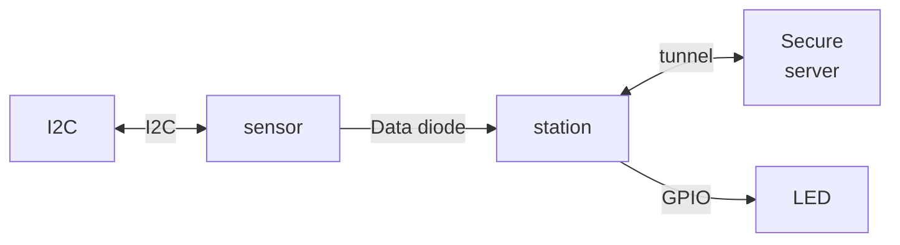

# Weather Station

This tutorial is a step by step implementation of the Weather Station example provided by Kry10 for their KOS operating system.  In this, you will do the following:

- Implement and use an I2C server
- Implement a data diode
- Create a GUI 
- Communicate with a secure KOS server 
- Implement native C code using a NIF
- Use GPIO to interact with hardware

## Diagram

## Software version

This tutorial was constructed with KOS version 1.0.0-epsilon for the **BeagleBone Black (am335x)** platform.

## Hardware requriements (am335x)

### BeagleBone Black

- BeagleBone Black (BBB)
- USB cable (typically comes with a BBB)
- [USB to TTL Serial cable](https://www.sparkfun.com/ftdi-cable-5v-vcc-3-3v-i-o.html)
- Ehternet cable
- MicroSD card formatted and setup for fastboot.  Instructions are in Kry10's documentation.

### Sensor

- [Atmospheric sensor BME280 Qwiic](https://www.sparkfun.com/sparkfun-atmospheric-sensor-breakout-bme280-Qwiic.html)
- [Qwiic cable kit](https://www.sparkfun.com/sparkfun-Qwiic-cable-kit.html)

## Steps

The steps for this tutorial and solutions for each step are provided in branches to this ``main`` repository.

- Step 0:  Initial setup
- Step 1:  Create the I2C server and communicate with it
- Step 2:  Communicate with the BME280 sensor

Other steps will be added in the future.