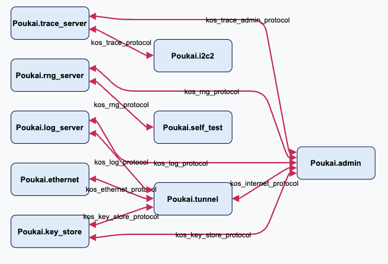

# Step 1:  I2C Setup

In this step, we will add the I2C server and setup the sensor app to communicate with it.

We need to make changes in three places:

1.  The mix project file, ``mix.exs``
2.  The manifest, ``lib/manifest.ex``
3.  The config file, ``config/config.exs``

## The mix project file

We need to add the I2C server tot he build path.

```elixir
   defp deps do
     kos_builtins = System.get_env("KOS_BUILTINS_PATH", "KOS_BUILTINS_PATH-NOTFOUND")
     [
       {:kos_manifest_systems, path: Path.join(kos_builtins, "kos_manifest_systems")},
+      {:kos_i2c, path: Path.join(kos_builtins, "kos_i2c")},
     ]
   end
 end
```

## The manifest

```elixir
   @impl true
   def setup(context) do
     # get information about the I2C bus and make the port name
+    i2c_bus = Application.get_env(:manifest, __MODULE__)
+      |> Keyword.get(:i2c_bus)
+    i2c_port = "kos_#{i2c_bus}_protocol"
+ 
     # Remove this line when you want to enforce signed upgrades
     # See `mix help kos.manifest.sign` for commands for signing a manifest.
     {:ok, context} = set_kos_options(context, %{disable_signing: true})

     # Add new applications here:
     # {:ok, context, _} = put_app(context, MyApp)
 
+    context = context
+    |> put_port!(i2c_port, Poukai.msg_server())
+    
     # Checks to make sure that each app has valid KOS tunnel IP configurations
     {:ok, context} = Tunnel.check_tunnel_ips(context)
```

The first bit gets information about the I2C and makes a name for the ``i2c_port``.  These are configured in ``config/config.exs``.  The name of the port is important because the I2C server specfies the name of the port automatically, and we need to match it.

The secon part add the ``i2c_port`` to the ``context``.  This notation uses the pipe ``|>`` operator.

## The config file

In ``config/config.exs`` we need to do two things:

1.  Setup some information needed by the I2C server.
2.  Add a configuration for the I2C to the manifest.

```elixir
 config :kos_manifest, default_module: WxStationManifest
 
+{i2c_settings, i2c_bus} = {
+    %{
+      i2c2: %{
+        bus_speed: :i2c_slave_speed_standard,
+        devices: %{"wx_sensor" => [0x77]}
+      }
+    },
+    "i2c2"
+  }
+
 config :kos_manifest_systems, KosManifestSystems.Poukai, 
   tunnel_ips:  %{
           "Poukai.admin" => %{ADDR: "192.168.2.6", MASK: "255.255.255.0", GW: "192.168.2.100"},
         },
-  tunnel_settings: []
+  tunnel_settings: [],
+  i2c_settings: i2c_settings,
+  i2c_trace_settings: ["i2c_server"],
+  tracing_enabled: true
+
+config :manifest, WxStationManifest,
+  i2c_bus: i2c_bus
```

The first part configures the ``i2c_settings``, which is a map and specifies the ``bus_speed`` and the device we will add in the next step.  We will call that device ``wx_sensor``.  We know that the device address for the sensor is ``0x77``.  We will set that now.

## Build and run

Build and run to make sure it works.

```terminal
$ mix kos.build
$ kos-run --iface $IFACE --serial $SERIAL
```

The system should look something like this.



Note the I2C server ``Poukai.i2c2`` is there but not connected to anything other than the trace server.