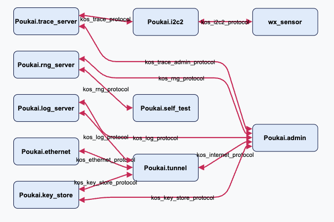

# Step 2:  Setup the sensor app

In this step, we will just create an app for the weather sensor.  We won't install the drivers for the weather sensor yet.  That is for the next step.

##  Setup a C app

In the system's main directory, add a new C app.

```terminal 
$ mix kos.new.app.c wx_sensor
```

You will get instructions like this, but we will change things just a bit, so don't follow them.

```terminal
To import this application into a KOS system, perform the following,
replacing `my_system` with the path to your KOS system directory:

Add the new app to your system's dependencies in my_system/mix.exs,
adjusting the path to your app directory as necessary:
  ...
  {:kos_manifest_systems, path: Path.join(kos_builtins, "kos_manifest_systems")},
  {:wx_sensor, path: "../wx_sensor"}
  ...

Add the new app to your system's setup() call in my_system/lib/manifest.ex:
  # Add new applications here:
  # {:ok, context, _} = put_app(context, MyApp)
  {:ok, context, _} = put_app(context, WxSensor)

Assign an IP address to the new app in the system's my_system/config/config.exs:
  config :kos_manifest_systems, KosManifestSystems.Poukai,
    tunnel_ips: %{
      "Poukai.admin" => %{ADDR: "192.168.2.6", MASK: "255.255.255.0", GW: "192.168.2.100"},
      "wx_sensor" => %{ADDR: "192.168.2.7", MASK: "255.255.255.0", GW: "192.168.2.100"},
    },
```

We need to make changes to two files.

1.  The mix project file ``mix.exs`` 
2.  The manifest ``lib/manifest.ex``

### The mix project file

Add the path for the ``wx_sensor``.

```elixir
   defp deps do
     kos_builtins = System.get_env("KOS_BUILTINS_PATH", "KOS_BUILTINS_PATH-NOTFOUND")
     [
       {:kos_manifest_systems, path: Path.join(kos_builtins, "kos_manifest_systems")},
       {:kos_i2c, path: Path.join(kos_builtins, "kos_i2c")},
+      {:wx_sensor, path: "./wx_sensor"},
     ]
   end
 end
```

### The manifest

We need to add the sensor app to the context.  This is done as follows:

```elixir
     context = context
     |> put_port!(i2c_port, Poukai.msg_server())
+    |> put_app!(WxSensor, [i2c_port])
```

Note, we also include the ``i2c_port`` in a list, which is an optional input to the ``WxSensor`` module.  This will become an input to the C program ``wx_sensor/src/main.c`` and is how we let that program know what the name of the I2C port is.

## Setup the ``wx_sensor`` app

Next we make some changes to the ``wx_sensor`` app.  This happens in several places.  We need to modify the app's manifest.  We need to update its CMake file.  And finally, we need to modify the source code to communicate with the I2C server.

Keep in mind, this has two versions of names

| **C**          | $\leftrightarrow$ | **Elixir**   |
|----------------|-------------------|--------------|
| ``wx_sensor``  | $\leftrightarrow$ | ``WxSensor`` |

### The app's manifest

```elixir
   @impl true
   @spec setup(Context.t(), Keyword.t()) :: {:ok, Context.t()} | {:error, any}
   def setup(context, opts \\ []) do
     # Add additional device resources or register clock/pinmux setups if required.
     msg_server = Keyword.get(opts, :msg_server, Poukai.msg_server())
-    rng_port = Keyword.get(opts, :rng_port, "kos_rng_protocol")
-    log_port = Keyword.get(opts, :log_port, "kos_log_protocol")
-    internet_port = Keyword.get(opts, :internet_port, "kos_internet_protocol")
+    i2c_port = hd(opts)
 
     # Set any environment variables you want your app to use for configuration here
     environ = %{
```

We aren't going to use the ``rng_port``, the ``log_port``, or the ``internet_port`` in this app, so we will get rid of those.  We also need to eliminate them further down, as show below.

```elixir
       max_priority: 150,
       priority: 145,
       environ: environ,
+      arguments: [i2c_port],
+      resources: %{ device_frames: [%{address: 0x4804C000, size: 0x1000}] },
+      #
       msg_servers: [
         %{
           name: msg_server,
           dir_access_control: %{
-            rng_port => AccessControl.client(),
-            log_port => AccessControl.client(),
-            internet_port => AccessControl.client(),
+            i2c_port => AccessControl.client(),
           }
         }
       ]
```

Above we add several things:

- ``arguments:  [i2c_port]`` lets the ``i2c_port`` name be one of the arguments to the C app.
- ``resources:`` defines an address and size of memory-mapped hardware register.  ``0x4804_C000`` is the base address for the I2C2 controller in the processor’s memory map.  It's used when to talk directly to the sensor.
- Lastly, we give the app access to the ``i2c_port`` in the message broker.

## Modify the C code

Here we go through the setup of the C code to get it working with I2C.

### Include files

Begin with some include files.

```c
 #include <kos.h>
+#include <kos_utils.h>
+#include <i2c_client.h>
```

### Token slot indexes

I think the name ``token_slots`` is misleading and prefer ``token_slot_index`` because that is what the enumeration is keeping track of.  We need to add two indices

1.  The client transport
2.  The I2C token

So, get rid of this.

```c
-// Declare a set of static token slots for our message server communications
-enum token_slots {
-    TOKEN_CLIENT = 1,
-    TOKEN_LOGGING
```
and add this.
```c
+#define I2C_GET_FEATURES    2
+
+enum token_slot_index {
+    TOKEN_CLIENT_TRANSPORT = 1,
+    TOKEN_I2C
 };
```

### Get rid of some default code

The default code makes the client instance a global variable.  I don't like globals because they can lead to problems, so let's delete this.  We also won't be able to use their canned ``setup_msg_server()``, so delete it too.

Actually, you can repurpose some of this code below, so read on before deleting.

```c
-// Declare our msg server client instance
-// NB: This instance is global because it should always be in scope for the
-// life-time of the thread. However, it is not thread-safe - each thread
-// should be given its own message server client instance.
-kos_msg_client_t client = {0};
-
-/*
-* Create a high-level connection to the message server
-* so that the C application can use or bind ports.
-*/
-void setup_msg_server() {
-  kos_status_t status;
-  kos_cap_t receive_cap = kos_cnode_cap(kos_app_cnode(), KOS_ROOT_RECEIVE);
-  kos_cap_set_receive(receive_cap);
-
-  status = kos_msg_setup();
-  kos_assert_created(status, "kos_msg_setup");
- 
-  kos_cap_t client_cap = kos_cap_reserve();
-  status = kos_msg_client_create(client_cap, TOKEN_CLIENT, &client);
-  kos_assert_created(status, "kos_msg_client_create");
-}
```

### Get the arguments to ``main()``

In ``main()`` we want to get the arguments for the function; the second argument will be the ``i2c_port``.

```c
+    // Get the i2c port name from the arguments
+    // We expect two arguments:
+    // 0. app name
+    // 1. i2c port name 
+    kos_assert_eq(argc, 2, "unexpected number of arguments for weather sensor");
+    char* app_name = argv[0];
+    char* i2c_port = argv[1];
+  
+    kos_printf("Initializing %s\n", app_name);
```

### Setup the message broker

We don't need these lines.

```c
-  // Implement normal runtime logic here
- 
-  setup_msg_server();
```

Now we need to setup the message broker.  This is where we can repurpose lines from ``setup_msg_server()``.

```c
+    // Setup the message broker
+    kos_cap_t receive_cap = kos_cnode_cap(kos_app_cnode(), KOS_ROOT_RECEIVE);
+    kos_cap_set_receive(receive_cap);
+  
+    status = kos_msg_setup();
+    kos_assert_created(status, "failed to setup msg server connection");
+
+    kos_printf("Message broker setup.\n");
```

### Setup the client transport

Now we need to setup a client transport.  This lets the app talk to the message broker.

```c
+    // Create a client transport
+    kos_cap_t client_cap = kos_cap_reserve();
+    kos_token_t token_client_transport;
+    kos_msg_client_t msg_client = {0};

+    status = kos_msg_client_create(client_cap, TOKEN_CLIENT_TRANSPORT, &msg_client);
+    kos_assert_created(status, "failed to create kos_msg_client");
 
+    kos_printf("Client transport setup.\n");
```

### Connect to the I2C server

Let's get rid of these lines.
```c
-  // Connect to the log port
-  status = kos_dir_request("kos_log_protocol", TOKEN_LOGGING, KOS_MSG_FLAG_SEND_TOKEN, NULL);
-  kos_assert_ok(status, "Request logging service");
```

Now, we can actually connect to the I2C server.
```c
+    /*
+    *   I2C SERVER
+    */
+    status = kos_dir_request(i2c_port, TOKEN_I2C, KOS_MSG_FLAG_SEND_TOKEN, NULL);
+    while(status != STATUS_OK) {
+        kos_printf("Could not connect to %s. Retrying after 1 s.\n", i2c_port);
+        kos_delay(1000000);
+        status = kos_dir_request(i2c_port, TOKEN_I2C, KOS_MSG_FLAG_SEND_TOKEN, NULL);
+    }
+    kos_assert_ok(status, "Problem connecting to i2c service");
+  
+    kos_printf("I2C connection established.\n");
 ```

### Communicate with the I2C server

These lines are not important for us.
```c
-  // Use the logging service to print a message
-  kos_log_info(TOKEN_LOGGING, "Hello Log Server", 0);
```

Now, lets try to communicate with the I2C server.  We won't get much, but we are looking for the ``status`` to be ``STATUS_OK``.  

```c
+    /*
+    *   Talk to the I2C server
+    */
+    uint32_t features;
+    status = kos_i2c_get_features(TOKEN_I2C, &features);
+    kos_assert_ok(status, "Problem with I2C features.\n");
+    /* 
+    *   This should print   Features 0x00000000 
+    */
+    kos_printf("I2C features:  0x%08x\n", features);  
```

### Fix a build error

Finally, and **super important** we need to change this line since version 1.0.0-epsilon has a build error.
```c
-  // Suspend the app
-  seL4_TCB_Suspend(KOS_ROOT_SLOT_TCB);
-  return 0;

+    kos_tcb_suspend(KOS_ROOT_SLOT_TCB);
+    return 0;
+
 }
```

## CMake file

To build this we need to modify the ``CMakeLists.txt`` file.

```cmake
# Copyright (c) 2022, Kry10 Limited. All rights reserved.
#
# SPDX-License-Identifier: LicenseRef-Kry10

cmake_minimum_required(VERSION 3.24)

# Set the KOS environment sources
set(CMAKE_C_COMPILER $ENV{KOS_CC})
set(CMAKE_TOOLCHAIN_FILE $ENV{KOS_RUNTIME_PATH}/share/toolchain.cmake)
list(APPEND CMAKE_MODULE_PATH $ENV{KOS_BUILTINS_PATH}/share)

project(wx_sensor C ASM)
add_compile_options(-fPIC)

# Include libraries as needed. One per include statement:
include(kos_i2c_client)
# include(kosup)

set(I2C "i2c")
set(I2C_CLIENT "-L$ENV{KOS_BUILTINS_PATH}/lib -li2c_client")

file(GLOB deps src/*.c)

add_executable(wx_sensor ${deps} ${bme280_files})

target_include_directories(
    wx_sensor 
    PRIVATE
    wx_sensor/src
    $ENV{KOS_BUILTINS_PATH}/include
)
target_link_options(wx_sensor BEFORE PRIVATE -pie)
target_link_libraries(wx_sensor ${I2C_CLIENT})
```
I would love to tell you all that's going on here, but I pretty much copied it from a Kry10 example, and I don't yet grok C make.

## Build and run

Build and run to make sure it works.

```terminal
$ mix kos.build
$ kos-run --iface $IFACE --serial $SERIAL
```

The system should look something like this.



Note the I2C server ``Poukai.i2c2`` is now connected to the ``wx_sensor``.

The output should look something like this:

```terminal
|      2.475| Poukai.admin       | ----  Poukai.admin ----
|      2.503| wx_sensor          | Initializing wx_sensor
|      2.509| Poukai.admin       | beam tunnel connection established:
|      2.519| wx_sensor          | Message broker setup.
|      2.529| Poukai.admin       | IP addr: 192.168.2.6
|      2.536| Poukai.admin       | Netmask: 255.255.255.0
|      2.546| wx_sensor          | Client transport setup.
|      2.562| Poukai.admin       | Gateway: 192.168.2.100
|      2.577| wx_sensor          | I2C connection established.
|      2.594| wx_sensor          | I2C features:  0x00000000
```
The last two lines are what's important.